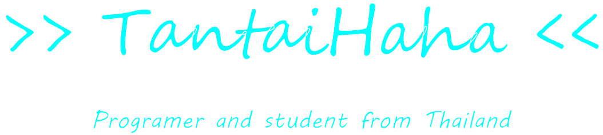

<h1 align="center">Thanachot Phomthong</h1>

<b>Developer · Creator · Builder</b>

<!-- 

  

 -->

  
  
  

  

<table align="center">
  <tr>
    <td valign="top">
      <pre>
tantaihaha4487@github:~$ whoami
----------------
Name     : Thanachot Phomthong
Alias    : Tantai, tantaihaha, Thanachot
Role     : Developer · Creator · Builder
Focus    : Web apps, Minecraft mods/plugins, automation
Goal     : Bring Project Mashiro to life
Timezone : ICT (UTC+7)
Based in : Thailand
      </pre>
    </td>
    <td valign="middle">
      
    </td>
  </tr>
</table>

<h2 align="center">Tech Stack</h2>

  
  
  
  

  
  
  
  
  

  
  
  
  

<h2 align="center">GitHub Stats</h2>
<!-- 

  
  

 -->
<!-- 

  

 -->

  

<h2 align="center">Contact</h2>

  
  
  

  
  
  

  
  

